# The Roller Coaster Informer

## Roller Coasters Database and Coaster Count Tracker

## Tech Stack
React/Flask/Postgres

## Overview/MVP
The Roller Coaster Informer (TRCI) is a web app that allows you to look up roller coaster information and save roller coasters to your profile as either coasters you've riden or want
to ride. I will most likely be creating my own api of roller coasters and their statistics. 

## Stretch
-Use an external news api to search news related to roller coasters and display that on a news page
-Allow users to search for roller coasters based on multiple different querys i.e. location, manufacturer, type, etc... 
-Embed a POV video of each coaster on their respective info page
-Add a social media aspect to it 
-Use a css library 

## User Stories
-On original load you will presented with a home page
-There is a nav bar with home, login, and signup options
-If logged in the home page will display your name otherwise it will have a general welcome message
-If the user is not logged in they will be able to search for roller coasters and see their 
information, but will not show any save options
-Once logged in, the nav bar will show a profile tab and an upload coaster page
-On each roller coaster page there will be an option to save the coaster to your ridden list or want to ride list
-On the profile page, it will show some user info and also their ridden list and their want to ride list
-If you click on a ride on the profile it will link you to that rides details 
-If the ride is already on one of the lists instead of a add to list button there will be a remove from list button
-On the upload page you will be able to add a coaster to the api 

## Routes
| http verb  | route | notes | 
| ------------- | ------------- | --- | 
|GET    | /                              | just says 'ok' |
| POST | /user/ | creates a new user |
| POST | /user/login | allows a user to login |
| GET | /user/verify | verifies user |
|POST    | /rollercoasters                              | adds roller coaster to database |
|PUT    | /rollercoasters                              | edit roller coaster in database |
|POST    | /rollercoasters/search                        |displays all roller coasters on search
|POST    | /rollercoasters/ridden/:id                        |User saves roller coaster they've ridden
|POST    | /rollercoasters/want_to_ride/:id                        |User saves roller coaster they want to ride
|DELETE    | /rollercoasters/ridden/:id                        |Removes coaster from your ridden list incase you're a liar
|DELETE    | /rollercoasters/want_to_ride /:id                        |Removes coaster from your want to ride list 

## ERB
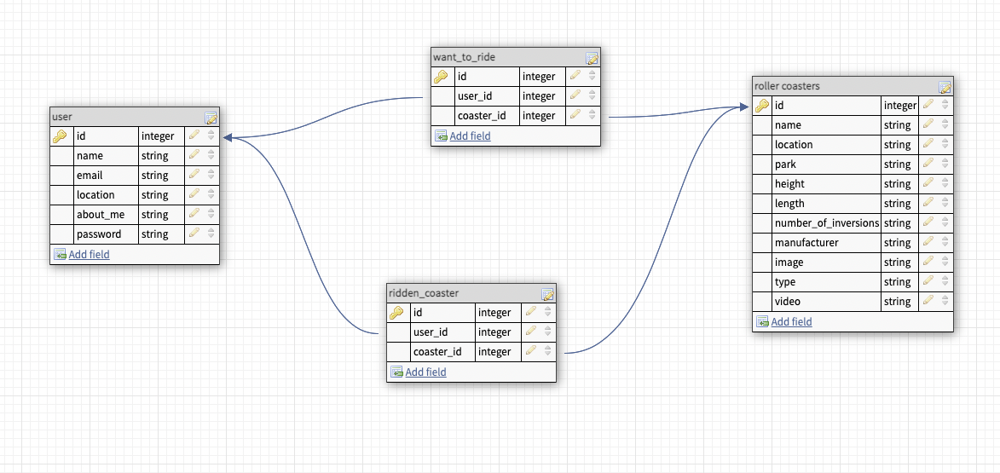

## Wireframes
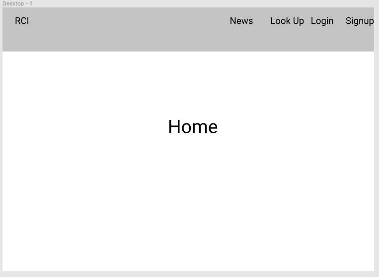
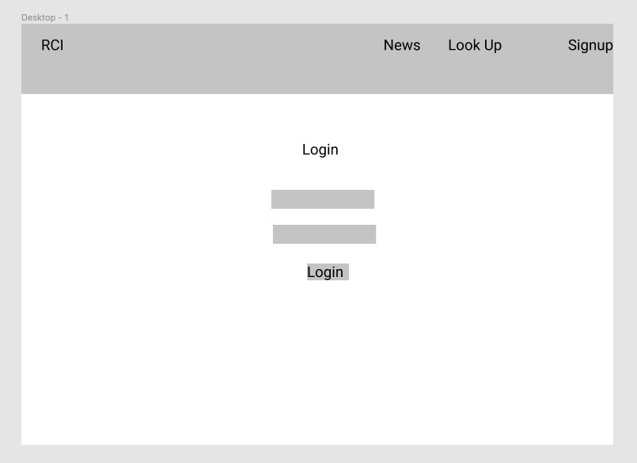
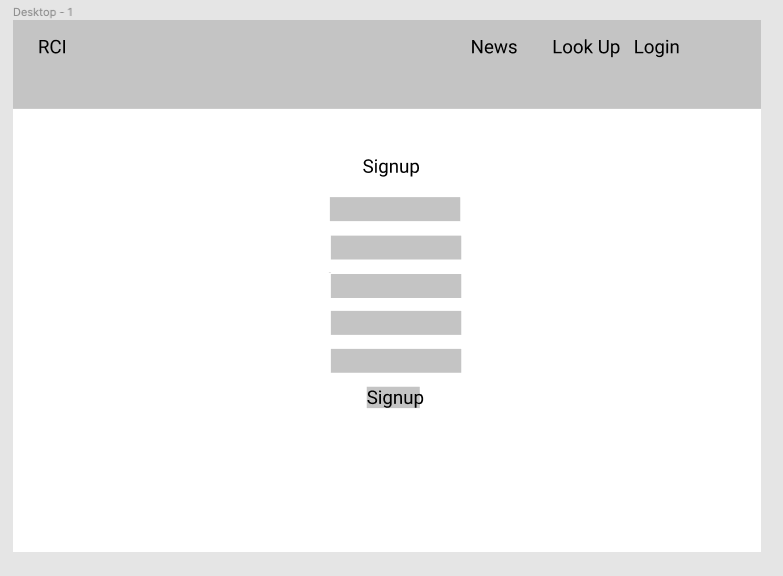
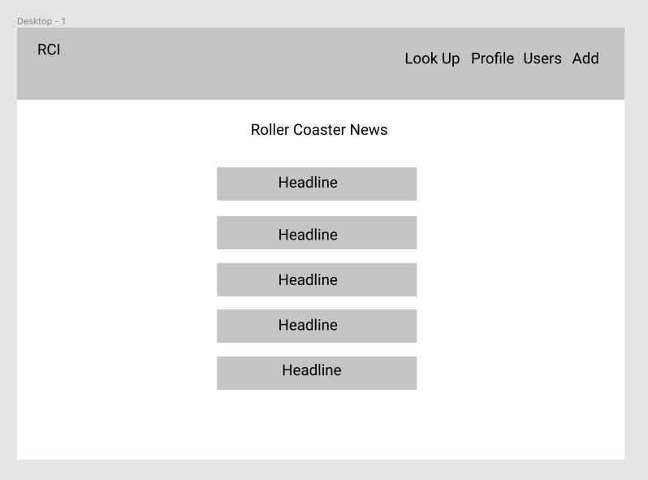
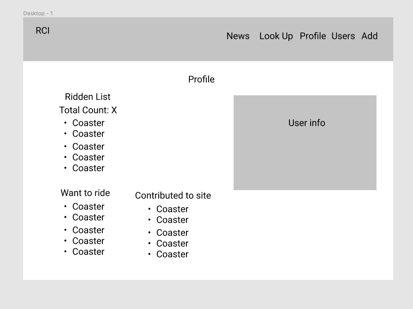
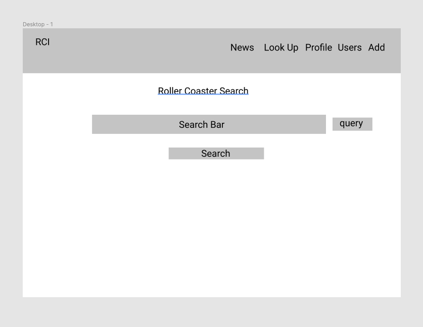
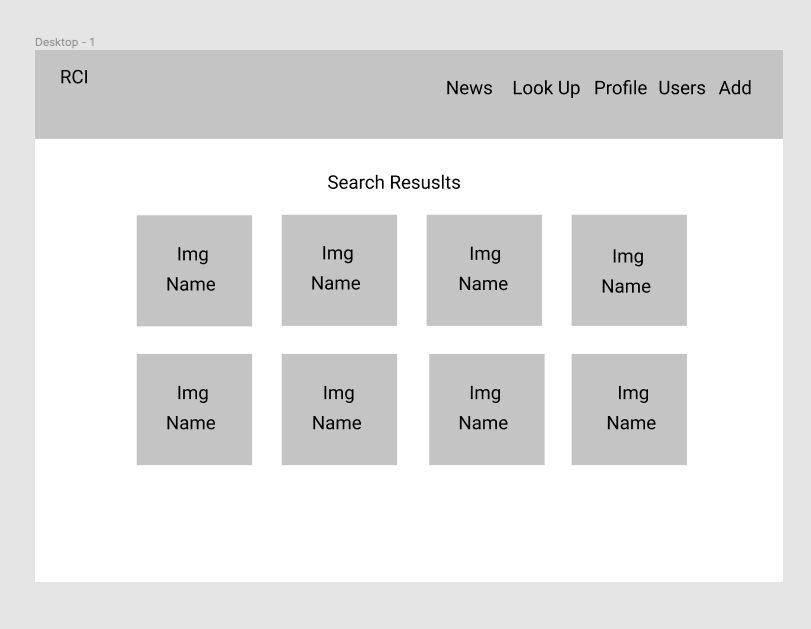
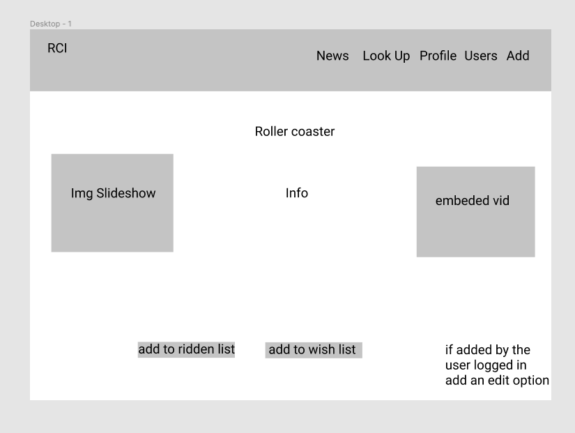
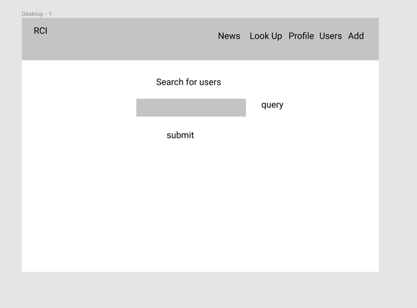
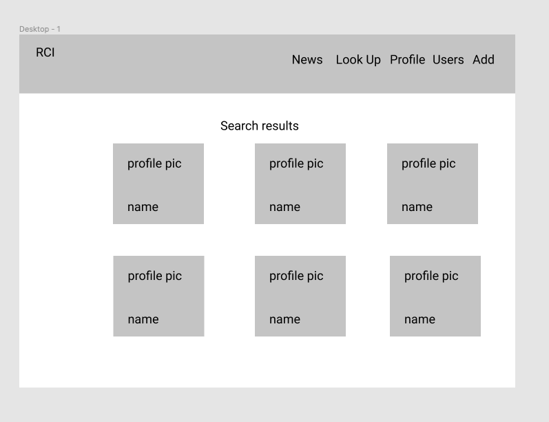

